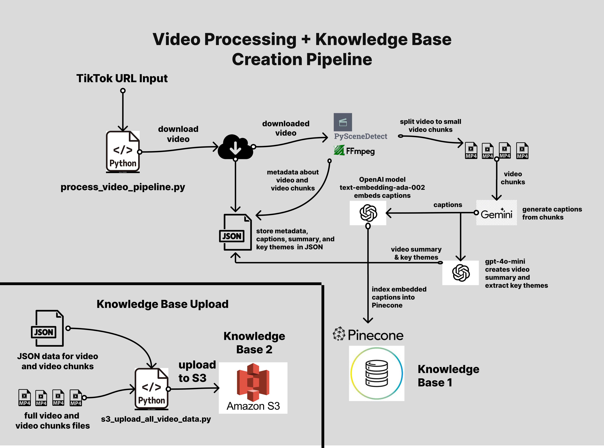
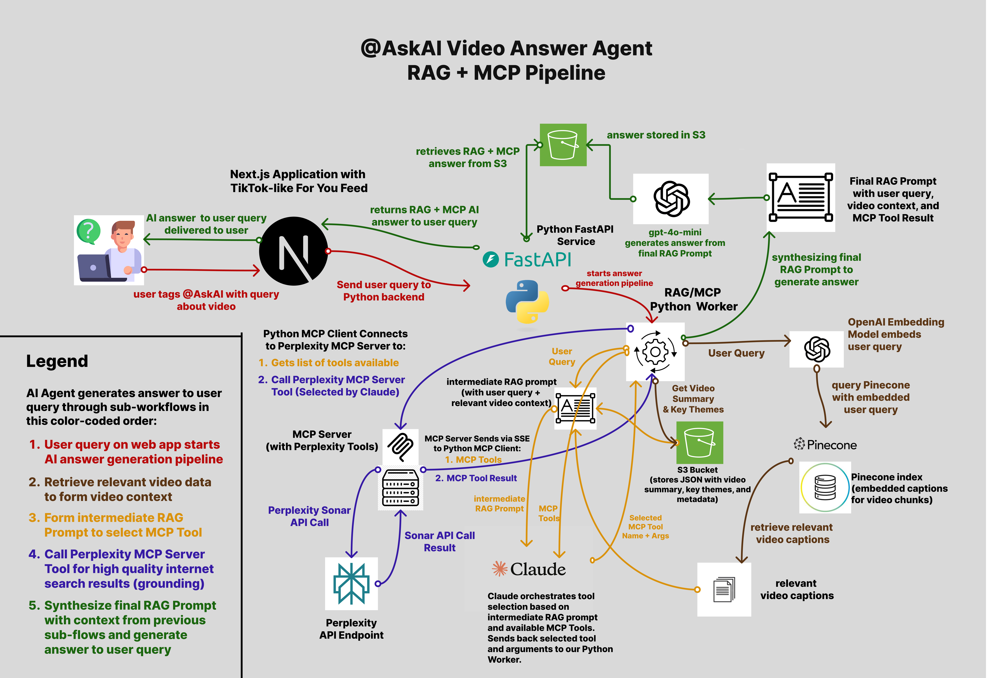

# Video Answer AI Agent (@AskAI Feature)

**Demo:** [Watch Here](https://drive.google.com/file/d/1vN5NG9629xjRAIErMd9mSAk38iwVm6b1/view?usp=sharing)

## Description

This application allows users to browse a vertical video feed (similar to TikTok) and ask specific questions about the content by tagging **`@AskAI`** in the comments and submitting a question. Then our AI Agent provides LLM-generated answers asynchronously, grounded in both the video's content and relevant external knowledge.

It demonstrates a modern **agentic AI workflow** that leverages **Retrieval-Augmented Generation (RAG)** to extract relevant video context and **Model Context Protocol (MCP)** to communicate via **Server-Sent Events (SSE)** with our Perplexity MCP Server, executing live web search tools (`perplexity_ask` or `perplexity_reason`) powered by Perplexity's Sonar API. The video context and tool call result is synthesized along with the user query into a high quality prompt to an **OpenAI LLM**, which generates the final answer to return back to the user. The user sees the answer as a reply to their comment from the `@AskAI` account.

_Note: This project is inspired by Perplexity's recent initiative to bring the @AskPerplexity feature to the TikTok For You page: ([Blog Post: Rebuilding TikTok in America](https://www.perplexity.ai/hub/blog/rebuilding-tiktok-in-america))_

## How It Works: The Two Core Flows

This system operates via two primary workflows: processing video to build knowledge base for RAG, and the agentic RAG + MCP Pipeline to answer questions about a specific video.

### **1. Video Processing & Knowledge Base Creation (Pre-computation)**

**Video Processing Pipeline Diagram:**



- _This process happens **before** a video appears on the main feed._

- Python script to run video processing pipeline is the `/video-processing-pipeline/process_video_pipeline.py`. Read more at `VIDEO_PROCESSING_PIPELINE.md` (in same direcory as script).
- **Acquisition & Chunking:** Downloads video from URL, splits video into chunks intelligently (scene detection with PySceneDetect with fallback to fixed duration chunking), and stores important metadata about the video and chunks (timestamps, duration, chunk number, etc).
- **Generating Chunk Captions and Overall Summary:** Generates detailed captions for each video chunk (using Gemini 2.5 Pro), then uses captions to query OpenAI to generate overall summary and extract key themes.
- **Indexing for Retrieval:** Creates vector embeddings with OpenAI's `text-embedding-ada-002` from captions and indexes them in Pinecone along with relevant metadata, building a searchable knowledge base specific to the video.
- **Upload to S3:** Video data (.mp4 file for full video, .mp4 files for video chunks, <video_id>.json files with generated chunk captions, overall video summary, key themes, and key metadata about video/chunks) are uploaded into our S3 bucket. This S3 data, along with our Pinecone index, forms our knowledge base for retrieval augmented generation (RAG).

### **2. Real-time: Answering a Query (`@AskAI` on the Feed)**

RAG + MCP Answer Generation Pipeline


- _This is triggered when a user tags `@AskAI` on a video from the main feed (which is already processed)._
- Read full details in `backend/app/BACKEND.md`
- **Query Understanding:** Embeds the user's question.
- **Retrieval (RAG):** Queries Pinecone to find the video captions that are most semantically similar to the user query. Extracts video summary and key themes from our <video_id>.json file in S3.
- **Context Assembly:** Builds relevant video context using the query, video summary/themes, and retrieved captions.
- **MCP Tool Selection & Use (Claude + MCP):** We initialize an MCP Client and an orchestrator (Claude) selects the best tool available from our Perplexity MCP Server (`perplexity_ask` or `perplexity_reason`), and synthesizes arguments to feed the tool based on our assembled context from the previous step. Then we call the tool with our MCP connection, getting an answer from the Perplexity MCP Server that is grounded in high quality internet search results. Read `backend/app/perplexity-mcp-server/PERPLEXITY_MCP_SERVER.md` for details on our MCP Server.
- **Synthesis:** An LLM (`gpt-4o-mini`) generates the final answer using the query, RAG context, and MCP results.
- **Asynchronous Delivery:** The answer is generated in the background. The user doesn't have to wait for the answer, they can continue watching videos, and once the answer is generated they will see it as a reply to their comment.

## Core Next.js Application features

- **Interactive Video Feed:** Scrollable feed displaying **pre-processed** videos ready for Q&A. The main viewable page will containt consist of the current video played, and a comment button (for user to comment and @AskAI a query about the video). Users can scroll down to see a new video.
- **`@AskAI` Feature:** Asynchronous Q&A on feed videos via comment tag (`@AskAI`), leveraging RAG + MCP for answers.
- Read more about our next.js application at `frontend/for-you-feed/FRONTEND.md`

## User Experience Flow

1.  **Launch & Browse:** Open app, scroll through the main feed containing **fully processed** videos.
2.  **Ask on Feed Video (`@AskAI`):**
    - Tap comment icon on a feed video.
    - Tag `@AskAI`, type question, submit.
    - Continue browsing; the RAG+MCP answer generation runs in the background. Answer will be ready within few seconds.
3.  **View Answer:** Navigate to the relevant video's comment section and read the AI-generated reply.

## Architecture Overview


- **Frontend (Next.js / Vercel):** UI, interactions, API calls (TypeScript, Tailwind CSS, App Router).
- **Backend (FastAPI / AWS App Runner):** API handling, background task management (distinct tasks for full processing vs. Q&A only), AI service orchestration (Python, Docker).
- **Storage (AWS S3):** Stores raw videos, chunks, and JSON metadata (`metadata.json`, `interactions.json`). Public read for `.mp4`.
- **Vector DB (Pinecone):** Stores and searches video caption embeddings for RAG.
- **AI Services:** Google Gemini (Captioning), OpenAI (Embedding, Summarization, Final Answer Synthesis), Anthropic Claude (Tool Orchestration), Perplexity (MCP Tools).

## Technology Stack

- **Frontend:** Next.js 15+, TypeScript, React, Tailwind CSS
- **Backend:** Python 3.10+, FastAPI, Uvicorn, Docker
- **Cloud:** AWS (S3, App Runner, ECR), Vercel
- **Database:** Pinecone (Vector DB)
- **AI APIs:** OpenAI, Google Cloud (Gemini), Perplexity, Anthropic
- **Protocols:** Model Context Protocol (MCP)

## Key Dependencies

- **Libraries/SDKs:** Boto3, Pinecone Client, OpenAI Clients, Google GenAI Clients, Anthropic Client, FastAPI, Next.js, `PySceneDetect`, `yt-dlp`, `mcp`, `fastmcp` library.
- **External APIs:** AWS, Pinecone, OpenAI, Google Gemini, Perplexity, Anthropic.

## Setup & Running Locally

**Prerequisites:**

- Node.js (v18+), Python (v3.10+), Docker, Git
- AWS Account & configured CLI
- API Keys: Pinecone, OpenAI, Google Cloud (Gemini), Perplexity, Anthropic

**1. Clone Repository:**

```bash
git clone https://github.com/your-username/video-answer-agent.git
cd video-answer-agent
```

**2. Backend Setup (`backend/`):**

```bash
cd backend
python -m venv venv && source venv/bin/activate # or .\venv\Scripts\activate
pip install -r requirements.txt
# Create .env with API keys, AWS config, S3 bucket, Pinecone details
uvicorn app.main:app --reload --port 8000
```

**3. Frontend Setup (`frontend/`):**

```bash
cd ../frontend
npm install # or yarn install
# Create .env.local with NEXT_PUBLIC_API_BASE_URL=http://localhost:8000
npm run dev # or yarn dev
```

_Access at `http://localhost:3000`._

**4. MCP Server Setup:**

- See documentation in `/backend/perplexity-mcp-server/PERPLEXITY_MCP_SERVER.md`

**5. AWS/S3 Configuration:**
_ Ensure S3 bucket exists with public read policy for `.mp4` and CORS configured for `localhost:3000` and deployed frontend URL.
_ Ensure Backend IAM role/user has S3 permissions.

**6. Initial Content:** \* Process initial videos using scripts or the "Process New Video" feature/API endpoint (`/api/process_and_query/async`) to populate the main feed.

## Key Trade-offs (for Development Speed)

- **Polling:** Frontend uses `setInterval` for status checks (vs. WebSockets).
- **S3 State:** JSON files in S3 manage state (vs. a database like DynamoDB).
- **Basic Background Tasks:** FastAPI's `BackgroundTasks` used (vs. Celery/RQ).
